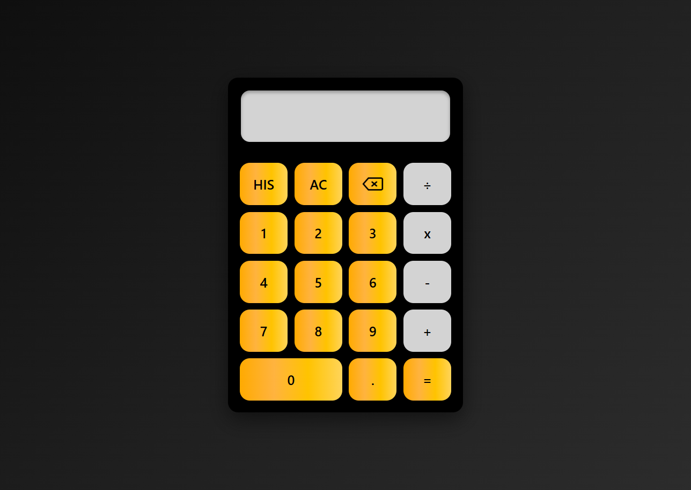

# Calculator

A modern calculator built using **HTML, CSS, and JavaScript**.
The calculator supports basic arithmetic operations, expression evaluation, calculation history, and a clean responsive interface.

## Preview

## Features

* Addition, subtraction, multiplication, and division
* Decimal number support
* Backspace functionality
* All Clear (AC) button
* Expression validation
* Calculation history
* Stores the last 10 calculations
* Clear history option
* Modern dark-themed UI
* Hover and click animations

## Technologies Used

* HTML5
* CSS3
* JavaScript (ES6)

## Learning Outcomes

Through this project I practiced:

* DOM Manipulation
* Event Handling
* JavaScript Functions
* Array Operations
* Conditional Logic
* CSS Grid Layout
* Responsive UI Design
* Dynamic Element Creation
