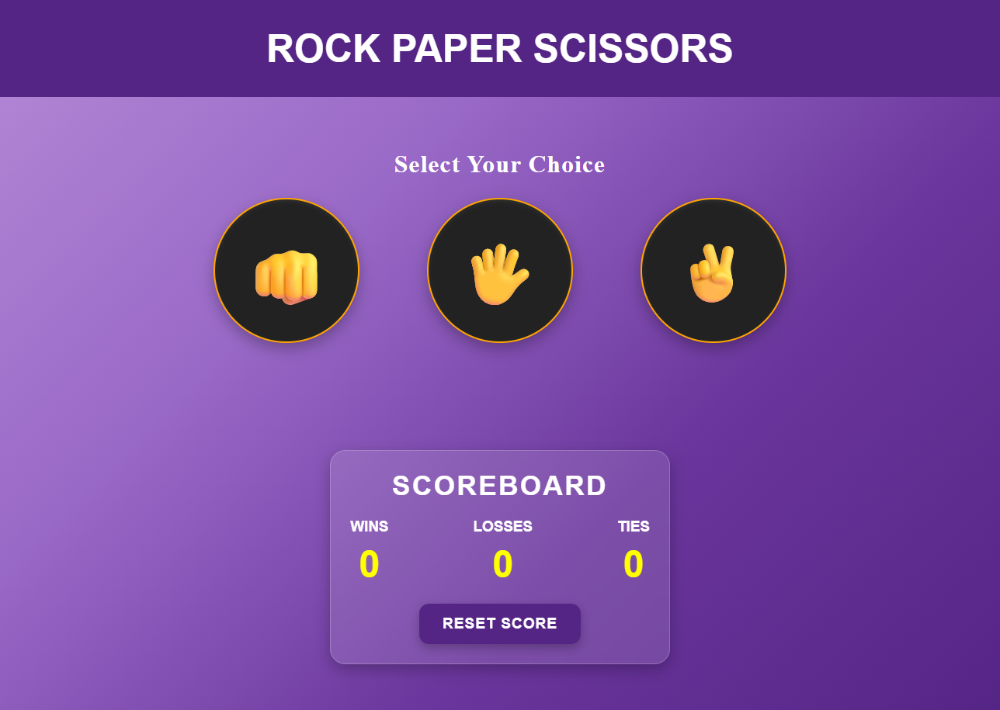

# Rock Paper Scissors Game

A modern browser-based Rock Paper Scissors game built using **HTML, CSS, and JavaScript**.

Play against the computer, track your performance, and enjoy a clean interactive interface with animations and persistent score storage.

## Preview

---

## Features

* Play against the computer
* Random computer move generation
* Real-time game results
* Win, Loss, and Tie tracking
* Persistent scoreboard using Local Storage
* Reset score functionality
* Animated result display
* Dynamic result colors
* Modern glassmorphism-inspired UI
* Responsive design

---

## Technologies Used

* HTML5
* CSS3
* JavaScript (ES6)

---

## Game Rules

| Your Choice | Computer Choice | Result |
| ----------- | --------------- | ------ |
| Rock        | Scissors        | Win    |
| Rock        | Paper           | Loss   |
| Paper       | Rock            | Win    |
| Paper       | Scissors        | Loss   |
| Scissors    | Paper           | Win    |
| Scissors    | Rock            | Loss   |
| Same Choice | Same Choice     | Tie    |

---