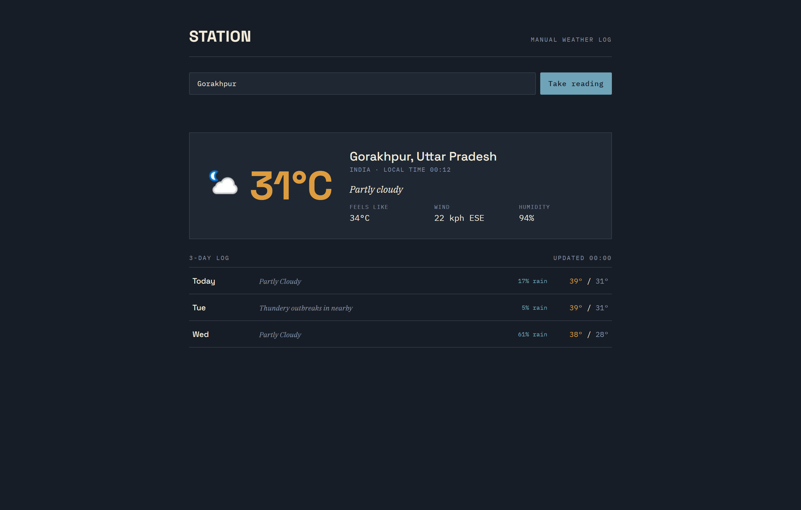

# Weather Station

A clean and responsive weather dashboard built with **HTML, CSS, and JavaScript**. It uses the **WeatherAPI** and the **Fetch API** to display real-time weather conditions along with a 3-day forecast.

## Preview

## Features

* Search weather by city, postcode, or latitude/longitude
* Automatically detects and displays weather for your current location
* Current temperature and "feels like" temperature
* Wind speed and direction
* Humidity
* Weather condition with icon
* 3-day weather forecast
* Responsive design for desktop and mobile
* Built using the Fetch API and async/await

## Tech Stack

* HTML5
* CSS3
* JavaScript (ES6+)
* WeatherAPI
* Fetch API